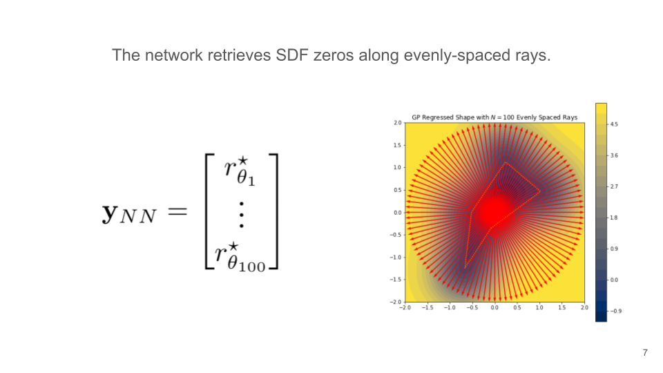
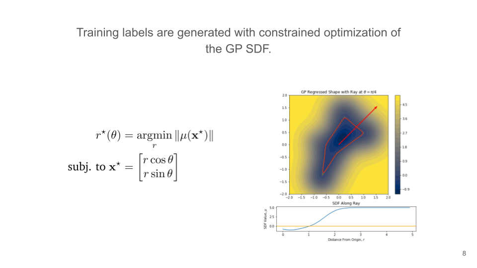
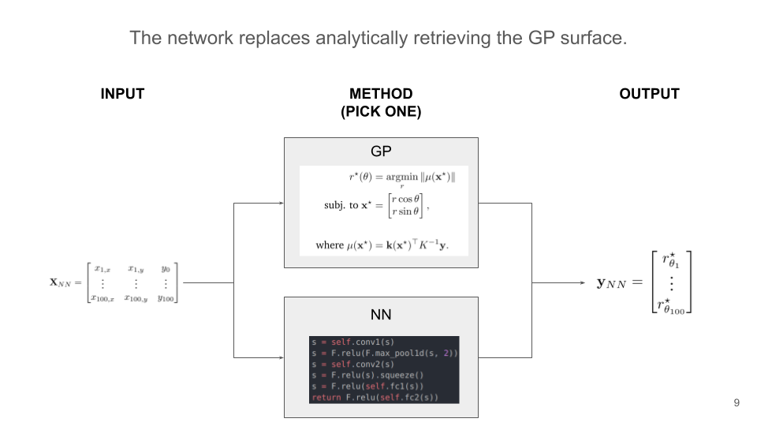

# GP Surface Retrieval with CNN

## Overview

This project explores GP surface retrieval using a convolutional neural network. Specifically, a network is trained to have:

* **input**: matrix of 2D points sampled from the surface of a polygon, along with associated signed distance field values. The polygon is centered around the origin. (Note: for consistency with GPs that require must be conditioned with points that are not on the surface, the first row of the matrix is [0, 0, -1])
* **output**: the distance from the origin to the object surface *that would be predicted by a GP trained on the same data*, along rays emitting from the origin at even intervals.

The following slides may be helpful.







## Installation
Use conda or pip to install the following requirements in an environment, if you don't already have them. I didn't have a requirements.txt file because some of them are tough to install. For [Pytorch](https://pytorch.org/), you'll probably want to set up CUDA, which is slightly involved.
```
numpy
Pillow
pytorch
tabulate
tqdm
scikit-learn
scipy
shapely
tqdm
argparse
```

## Usage
If you need to generate new data, use, e.g., 
```
$ python generate_data.py --output_dir my_dir --num_examples 42000
```
The default data location is into `network/data`, where the CNN will access it. I have already generated data, but I left this script so you can see how I did it.

To train the network, use:
```
$ cd network
$ python train.py --model_dir experiments/sdf_cnn
```

The neural network and its folder is based on [starter code](https://github.com/cs230-stanford/cs230-code-examples/tree/master/pytorch/vision) from Stanford's CS230 class, and their [documentation](https://cs230.stanford.edu/project/) is very good. There, you can read more about the cool training and hyperparameter tuning system they have set up -- for instance, your network automatically saves its best-yet weights and you can resume by passing a `--restore_file` argument.

## Structure
The code is divided into separate  `data_generation` and `network` folders as follows.

```
gpnn/
│   README.md
│   generate_data.py                # Script to generate training data
│
└───data_generation/                # Package supporting data generation
│   │   __init__.py
│   │   gp.py                       # Training and inferencing GPs
│   │   point_sampler.py            # Sampling points from polygon surface
│   │   shape_generator.py          # Random polygon generation
│   
└───figures/                        # Figures for this README
|
└───network
|   │   evaluate.py                 # Module + script for testing/validation
|   │   search_hyperparams.py       # Script for tuning params
|   │   synthesize_results.py       # Script for summarizing saved metrics
|   │   train.py                    # Module + script for training network
|   │   utils.py                        
|   |
|   └───data                        # Pickle files with partitioned data
|   |   └───test_sdf 
|   |   | 
|   |   └───train_sdf
|   |   | 
|   |   └───val_sdf
|   |   
|   └───experiments                 # Folders for trying different parameters
|   |   └───sdf_cnn
|   |
|   └───model
|   |   |   data_loader.py          # Pytorch dataloader class for train/test
|   |   |   net.py                  # Pytorch neural network
```